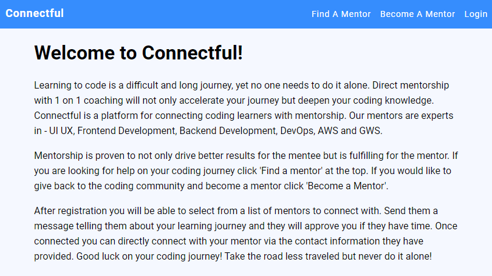
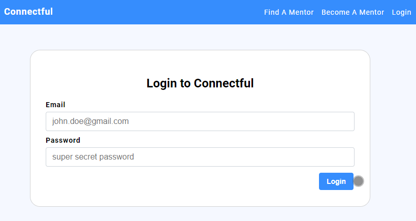
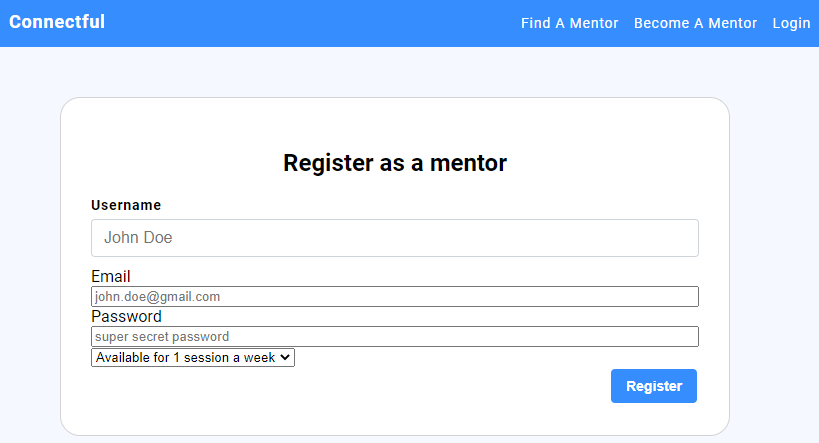
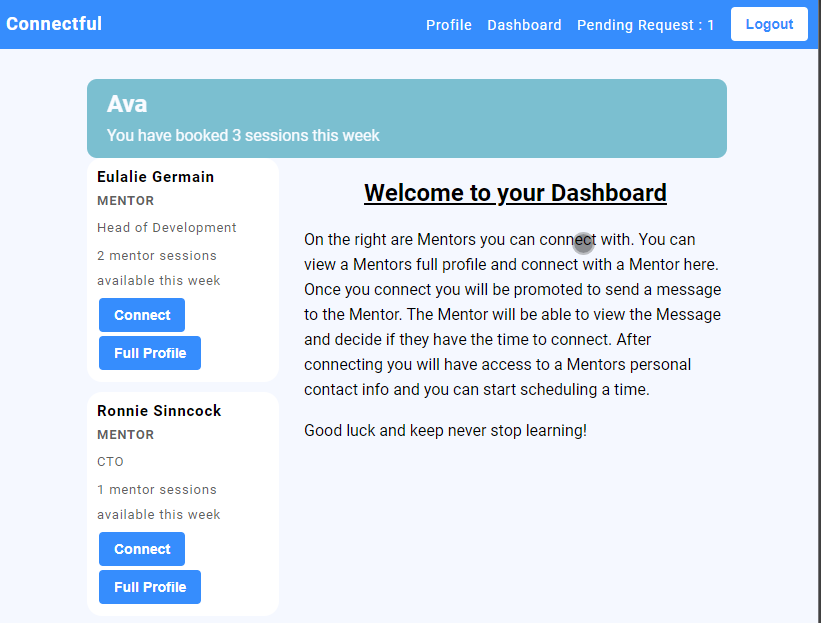
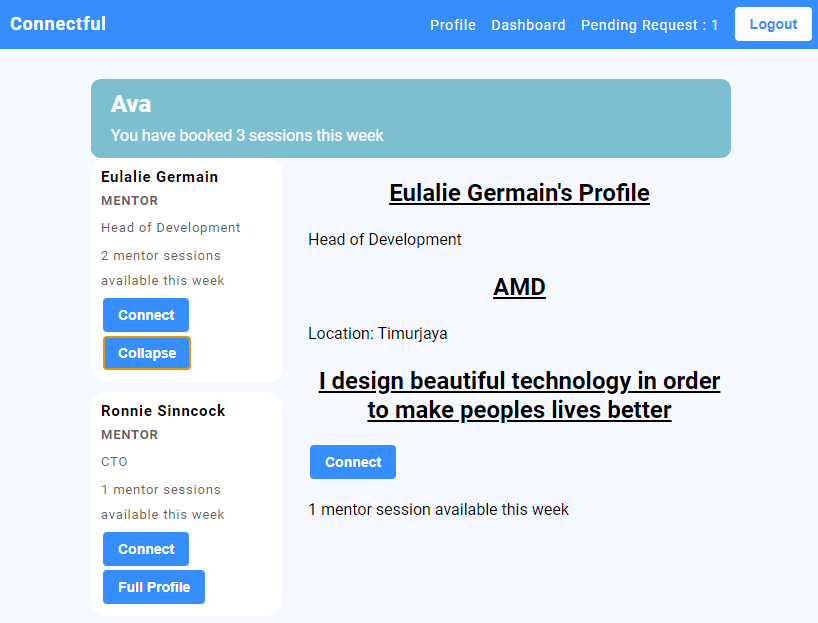
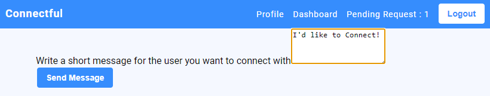
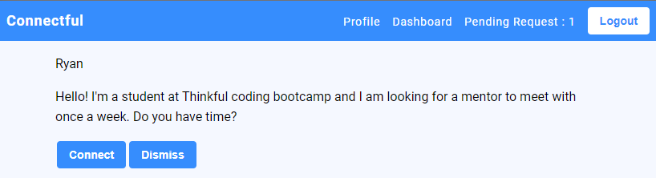
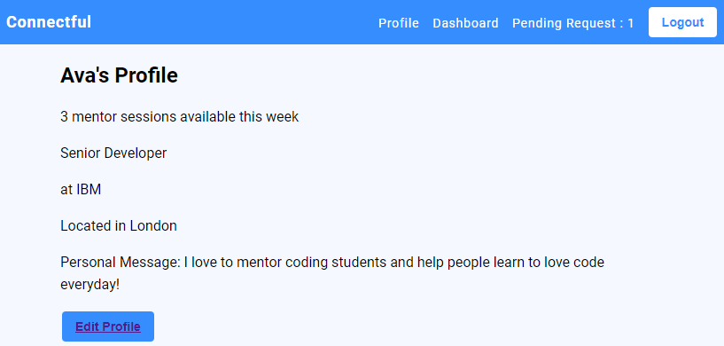
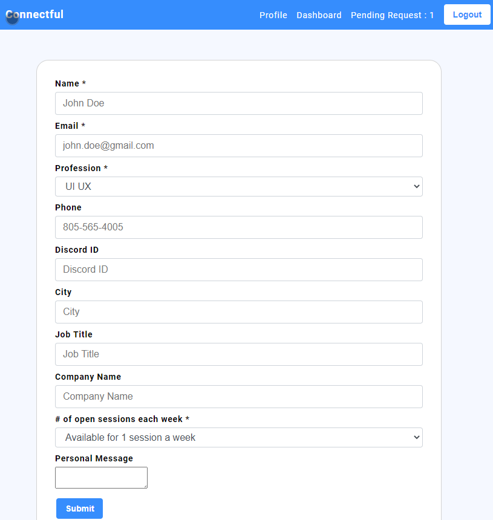

# Connectful Client

Welcome to Connectful a fullstack app that connects coding students with mentors. A user can register/login to view a dashboard full of coding mentors. The user can view the mentors profile and choose to connect with a mentor. The user can send the mentor a connection message. The mentor will see the number of pending connection request in the top menu and can choose to accept or not.

# Live Client & server

Client: https://
Server: https://localhost

# Built With

ReactJS HTML CSS

# How to Setup and Start

To setup the application

1. Fork and clone the project to your machine
2. `npm install`. This will also install the application

The project expects you have the server setup and running on http://localhost:8000.

## Running project

This is a `create-react-app` project so `npm start` will start the project in development mode with hot reloading by default.

# Screenshots

